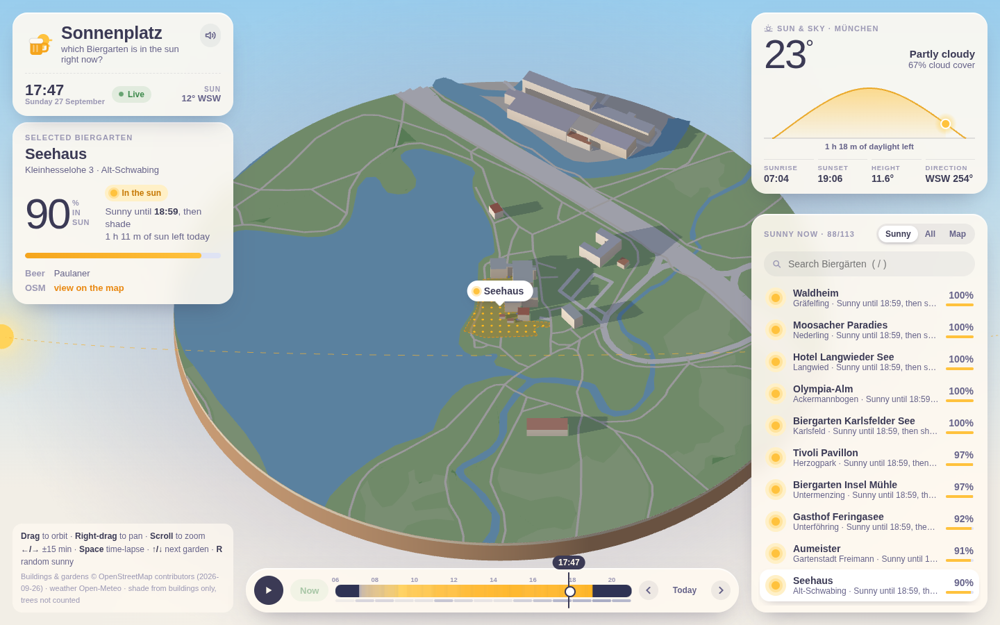
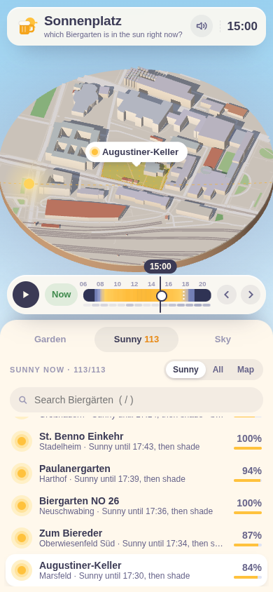

# Sonnenplatz ☀️🍺

**Which Munich Biergarten is in the sun right now?**

A 3D block map of Munich where building shadows follow the real sun. Pick a beer garden and watch the
shadows move across it, or check the list to see which gardens are sunny right now and when each one
loses the sun.

**Live:** https://sonnenplatz-claude.cryptopulse-bot.workers.dev





## Features

- **3D diorama:** the 290 m around each beer garden, built from OpenStreetMap building footprints and
  heights, plus parks, water, roads and rail. It's lit by the actual sun position with real-time shadows,
  and the sky shifts through golden hour and dusk.
- **Sunny list:** all 113 beer gardens with their share of sun right now and when that changes
  ("Sunny until 18:59, then shade", "sun from 14:10"). You can also view all gardens or a map of Munich.
- **Sun & sky card:** live temperature and cloud cover from Open-Meteo, the sun's path for the day,
  sunrise and sunset. When it's overcast, the page says the shadows show where the sun *would* be.
- **Time travel:** drag the time bar to any minute, step through days, or play a time-lapse. The bar is
  coloured by when the selected garden gets sun, with a cloud-cover row underneath.
- **Garden details:** opening hours, seats, beer brand and website where OSM has them.
- Shareable links (`#augustiner-keller@2026-07-12T1630`), keyboard shortcuts, synthesized sound, and a
  phone layout.

| Key | Action |
|---|---|
| `←` / `→` | ±15 minutes (`Shift` for ±1 hour) |
| `Space` | play / pause the time-lapse |
| `N` | back to now |
| `↑` / `↓` | previous / next garden in the list |
| `R` | random sunny garden |
| `[` / `]` | previous / next day |
| `/` | search |
| `M` | sound on/off |

## How it works

Rendering shadows is easy: three.js shadow maps handle that. The interesting part is the **list**:
answering "is it sunny?" for 113 gardens, every minute of the day, fast enough to redraw while
you drag the time bar.

The trick is to do the geometry once, at build time:

1. **Sample points.** Each garden's OSM outline gets a grid of up to 64 points (skipping points inside
   buildings). About half the gardens are mapped only as a single point; for those, a ~22 m circle is used.
2. **Horizon profiles.** For every sample point, `tools/build.mjs` casts a ray every 1° of compass
   direction against all building edges within ~330 m. It stores the highest angle at which a building
   blocks the sky in that direction: 360 bytes per point, in 0.5° steps.
3. **At runtime** the browser computes the sun's altitude and azimuth (SunCalc algorithm, `public/sun.js`).
   A point is sunlit when `sunAltitude > horizon[point][round(azimuth)]`. That's one array lookup per
   point, so the page precomputes the whole day (1440 minutes × 113 gardens) in tens of milliseconds when it
   loads or the date changes.

The yellow and blue dots drawn on the selected garden come from this lookup, while the shadows come
from the GPU shadow map. In testing, the two agree.

Only **the sun and the weather change during the day**, and both are computed or fetched live in the
browser. The saved map data (buildings, gardens) changes only when people edit OpenStreetMap, so
refreshing it a few times a year is enough.

### Building heights

OSM `height` is used when present. Otherwise the height comes from `building:levels` (3.1 m per level plus a
roof). If neither exists, it's estimated from the building type (house, apartments, garage, church, …) or
from footprint size. About a third of buildings near the gardens have levels or height tagged.

## Project layout

```
public/                 the static site (deployed as-is)
  index.html, style.css
  app.js                three.js scene, time logic, UI
  sun.js                sun position
  data/gardens.json     beer gardens, sample points, OSM info
  data/horizon.u8.txt   horizon profiles (raw bytes; .txt only so Cloudflare compresses it)
  data/g/<id>.json      3D scene around each garden
tools/
  extract.py            OSM extract (.pbf) → data-raw/*.json   (pyosmium)
  build.mjs             data-raw → public/data                  (Node, no dependencies)
wrangler.jsonc          Cloudflare Workers static-assets config
```

No build step and no npm dependencies. three.js is loaded from jsDelivr via an import map.

## Run locally

```bash
python3 -m http.server 8000 -d public     # or: npx wrangler dev
# open http://localhost:8000
```

## Refresh the OpenStreetMap data

```bash
python3 -m venv .venv && .venv/bin/pip install -r tools/requirements.txt
mkdir -p data-raw
curl -L -o data-raw/Muenchen.osm.pbf https://download.bbbike.org/osm/bbbike/Muenchen/Muenchen.osm.pbf
.venv/bin/python tools/extract.py        # ~3 min: gardens, district names, buildings + ground near gardens
node --max-old-space-size=6000 tools/build.mjs   # a few seconds: sample points, horizons, scene files
```

`data-raw/` is git-ignored because the downloads are several hundred MB.

What counts as a beer garden: `amenity=biergarten`, `beer_garden=yes`, `biergarten=yes`, or
`leisure=outdoor_seating` with "Biergarten" in its name, inside the Munich bounding box
(48.061–48.248 N, 11.36–11.723 E). Places tagged as fast food or cafés are skipped.

## Deploy

Hosted on Cloudflare Workers static assets (free plan):

```bash
npx wrangler deploy
```

## Limitations

- **Only buildings cast shade.** Trees, umbrellas and awnings aren't counted, and many beer gardens sit
  under chestnut trees, so real shade is heavier.
- Terrain is treated as flat, which is mostly fine for Munich, less so on the Isar slopes.
- Gardens mapped only as a point use an approximate circle instead of the real outline.
- Sun position is computed for Marienplatz; the difference across the city is a tiny fraction of a degree.
- Estimated building heights are guesses where OSM has no height or level data.

## Credits

- Map data © [OpenStreetMap](https://www.openstreetmap.org/copyright) contributors, available under the
  [ODbL](https://opendatacommons.org/licenses/odbl/). The files in `public/data/` are derived from it and
  fall under the same license. Extract via [BBBike](https://download.bbbike.org/osm/).
- Weather by [Open-Meteo](https://open-meteo.com/).
- Sun position after [SunCalc](https://github.com/mourner/suncalc) by Vladimir Agafonkin (BSD-2-Clause).
- Rendering by [three.js](https://threejs.org/).
